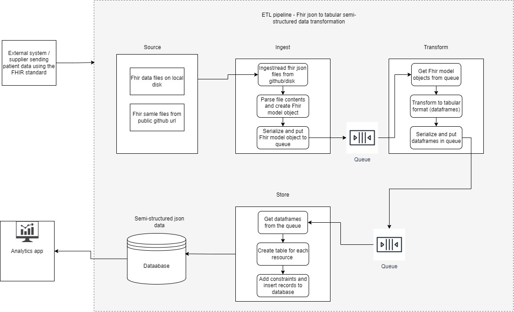
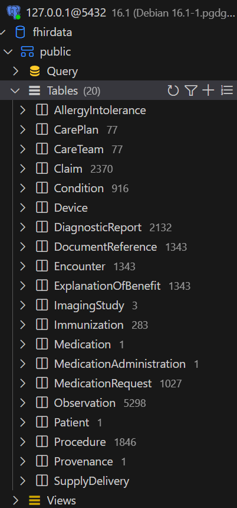
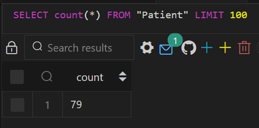
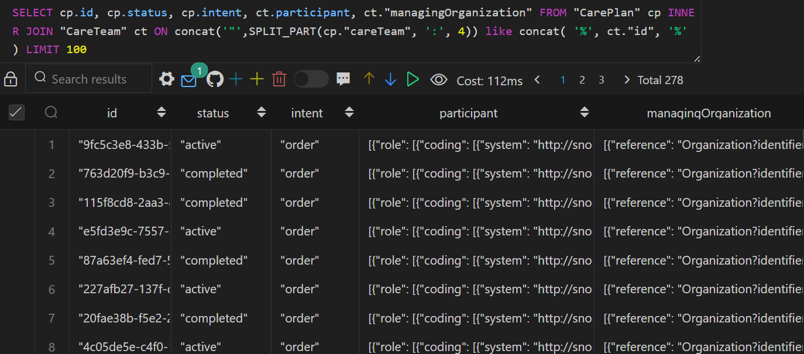

# Table of Contents

[INTRODUCTION 2](#_Toc154917524)

[ASSUMPTIONS: 2](#assumptions)

[ARCHITECTURE 3](#_Toc154917526)

[CHOICE OF TECH STACK: 4](#_Toc154917527)

[IMPLEMENTATION: 4](#_Toc154917528)

[RUNNING THE PIPELINE 6](#_Toc154917529)

[VALIDATION: 7](#_Toc154917530)

[SUMMARY 8](#_Toc154917531)

INTRODUCTION:

This document describes the proof of concept (PoC) developed to
transform Fhir json data to tabular semi-structured format so that SQL
queries can be used to extract patient information for analytics.

Problem statement this PoC solves: An external system / supplier is
sending patient data to our platform using the FHIR standard. Our
analytics teams find this format difficult to work with when creating
dashboards and visualizations. You are required to transform these FHIR
messages into a more workable format preferably in a tabular format.
Include any documentation / commentary you deem necessary.

Reference: <https://github.com/dmauktik/exa-data-eng-assessment>

# ASSUMPTIONS:

Since the problem statement is open ended, following assumptions are
made while designing the solution:

1.  Sample data is provided in a folder named ‘data’ and how an external
    system is sending this data is not known. So, the data pipeline is
    developed such that it can read input from local disk or public
    github url.

2.  Since the input data is read from public github url or local disk,
    authentication and authorisation is not considered. In real world,
    auth is one of the most important factor to be considered.

3.  It is not clear which information in the fhir json files to pick up
    for analytics. So, the developed data pipeline is storing all the
    json fields in database (including metadata) for now.

4.  One Fhir json file/bundle is considered as one transaction. So, for
    79 files, storage module will do 79 database transactions.

5.  Json structure is flattened and stored in database. More refinement
    is possible but not considered for this PoC as it should be
    requirement specific.

6.  Client analytical systems are capable to query semi-structured json
    data from Postgresql tables using SQL statements or powerBI.

7.  Using fhir.resources parser to read and parse sample fhir json files
    is acceptable.

8.  Using a single python application with a container to showcase the
    functionality (for production it should be a decoupled and
    distributed system).

ARCHITECTURE:

The PoC ETL pipeline has 3 modules: Extract, transform and load.

The extract module ingests or reads fhir json files from the source
(data folder in this case) and parses file contents using fhir parser.

Transform module further processes the data to flatten FhirModel objects
and create dataframes (data represented in tabular format).

Load or storage module dumps the tabular data in database.

Extract and transform modules communicate with each other using a queue.

Similarly, transform and load/store module talk to each other via queue.

For the sake of simplicity, this PoC runs ingest, transform and storage
modules in a single docker container. For actual/production
implementation, all 3 modules should run as separate compute units each
having independent load balancing and auto scaling capabilities.

Queues are used to decouple heavy weight processing and smoothly scale
along with workloads. Again, for the sake of simplicity, this PoC uses
programmatic queues. In production, an independent queue system like
(RabbitMQ or SQS) to be used to make the data pipeline decoupled and
fault tolerant.

This PoC can be easily deployed to the AWS cloud environment as well.
The modules can be deployed as AWS Glue jobs, files to be ingested can
be placed on S3 bucket having a ‘file create’ trigger. The transformed
data can be stored in data warehouse like Redshift.

CHOICE OF TECH STACK:

Though any modern programming language can be used, this PoC has been
implemented in Python 3.10.

For data storage and analytical queries, PostgreSQL is used as it has
good support for semi-structured json data. Moreover, it should be
simpler to switch to a data warehouse in the future (like AWS Redshift
which is highly optimised postgresql DB cluster). It is observed that
attributes (like Patient, CarePlan, CareTeam, Observation, etc.) are
represented by unique ID and this ID is used as a reference or as a
foreign key. For example,

1.  Patient Id is referenced in Provenance table as target column.

2.  CarePlan table refers to CareTeam using id (foreign key)

Such relationships help shortlist datastore. Postgresql seems to be a
good choice as it has support for relational semi-structure json data.
For production load, ideal choice would be a data warehouse like
Redshift.

There are also other ways to implement these problem statement like -
Convert Fhir Json files to Parque format, store in a data lake and query
(using Athena or DuckDB) or load the generated Parque files to data
warehouse.

IMPLEMENTATION:

Python modules:

1.  Main: Entry point for the program. Input command line arguments are
    as follows:

usage: main.py \[-h\] -m {local\_disk,get\_file\_url,get\_folder\_url}
\[-d DIRECTORY\] \[-u; URL\]

options:

-h, --help show this help message and exit

-m, --mode {local\_disk,get\_file\_url,get\_folder\_url}

local\_disk: When Fhir json files are on local disk

get\_file\_url: raw github url pointing to a single Fhir file

get\_folder\_url: github url pointing to data folder containing Fhir
files.

-d, --directory DIRECTORY

Local directory path where fhir files are stored. This option is
mandatory with local\_disk mode.

-u; URL, --url URL

> github url of fhir file with 'get\_file\_url' mode or github folder
> url with 'get\_folder\_url' mode

Examples:

\# Command line examples:

python main.py -m "local\_disk" -d "/app/data"

python main.py -m "get\_file\_url" -u
"https://raw.githubusercontent.com/dmauktik/exa-data-eng-assessment/main/data/Aaron697\_Dickens475\_8c95253e-8ee8-9ae8-6d40-021d702dc78e.json"

python main.py -m "get\_folder\_url" -u
"https://github.com/dmauktik/exa-data-eng-assessment/tree/main/data"

The main module gets an event loop and runs ingest, transform and
storage tasks as asynchronous operations.

This PoC runs all the 3 tasks in the same container. As this PoC evolves
to a scalable solution, each module should run as a separate component
so that one can scale up and down independently. It will also help to
decouple the system and make it fault tolerant.

2.  Fhir\_reader module: The module reads provided fhir json files,
    parses each file using fhir.resources parser and puts FhirModel
    object to the fhir queue.

3.  Fhir\_queue module: The module holds an asyncio queue object. For a
    scalable pipeline, programmatic queue should be replaced with a
    separate messaging queue system.

4.  Process\_fhir module: The module reads FhirModel object (represent
    one bundle) from the fhir queue, reads all the available resources
    (Patient, Observation, Provenance, etc.), flattens json and creates
    dataframe objects. These dataframe objects are then sent to storage
    queue.

5.  storage\_queue module: The module holds an asyncio queue object. For
    a scalable pipeline, programmatic queue should be replaced with a
    separate messaging queue system.

6.  Store\_fhir module: The module reads dataframe objects from the
    storage queue, sets table constraints and store all the records in
    the configured database.

Containerisation and venv:

This PoC is deployed in two docker containers. One container is for
Postgresql database and other container has ETL pipeline tasks.

As this is a proof of concept, the python tasks( extract, transform,
load) and queues are made to run in a single docker container as a
python program.

In reality, production level data pipeline should have each task
(extract, transform, load) should run in a separate container or run as
an independent service along with external messaging queue system.

Moreover, as container is providing isolation, python venv is not
created but it is recommended if multiple programs/services run on the
same server/container.

RUNNING THE PIPELINE:

Follow the steps below to run the data pipeline PoC:

1.  Dependencies: Download docker desktop:
    <https://www.docker.com/products/docker-desktop/>

2.  Pull the code from the following github repository:

> <https://github.com/dmauktik/exa-data-eng-assessment>

3.  Edit .env file to set POSTGRES\_USER and POSTGRES\_PASSWORD
    environment variables

> Note: For the actual applications, credentials are either set by build
> system or secrets manager is used to store and access credentials.

4.  Open command-line and go the directory where docker-compose.yaml is
    present i.e. EXA-DATA-ENG-ASSESSMENT and run the following command:

> Docker compose up

This command will download postgresql-16.1 and python-3.10 docker images
and create two docker containers.

The python container will install python packages and its dependencies
using pip package manager.

Once all the dependencies are downloaded, datapipeline’s main module is
called.

Approximately, 8 seconds is the runtime to process one fhir bundle. So,
to process 79 fhir files, approximate required time is 10 minutes

Once all the files are processed successfully, python docker container
will exit with status 0 and Postgresql database will have required
tables.

Log file location in docker container: /app/transform\_fhir.log

Database name: fhirdata

Tables:

VALIDATION:

Patient table record count should be same as file count in data folder.

Note: The data is semi-structured json and all the tables have id as
primary key. Visualisation tools like powerBI which have the ability to
process json fields can be used. It is also possible to further
breakdown json fields to simplified format or store json text as jsonb
format based on the requirements.

Run queries on the tables to validate the data. Following query is a
join between two tables:

SELECT cp.id, cp.status, cp.intent, ct.participant,
ct."managingOrganization" FROM "CarePlan" cp INNER JOIN "CareTeam" ct ON
concat('"',SPLIT\_PART(cp."careTeam", ':', 4)) like concat( '%',
ct."id", '%' ) LIMIT 100

SUMMARY

Fhir json files can be transformed to the tabular format. Considering
the number of attributes in a bundle and relation between them (patient,
observation, careplan, etc.), a relational database with the ability to
run analytics queries (like Redshift and Postgresql) and support for
semi-structured json data would be a recommended approach.
